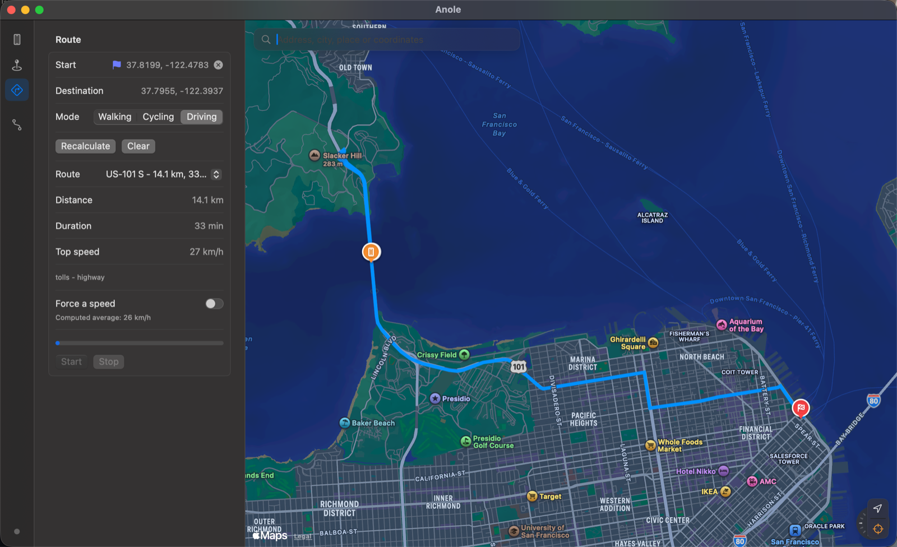

# Anole

Simulate your iPhone's GPS location — from your Mac, or from the iPhone itself.

Anole is two apps sharing one core: a **macOS app** that drives a tethered
iPhone, and an **iOS app** that changes its own location with no computer
involved. Both talk to Apple's developer services, the same channel Xcode uses
to test location-aware apps.

Named after the lizard that blends into wherever it happens to be.



*Driving from the Golden Gate Bridge to the Ferry Building.*

---

## What it does

- **Drop a pin, go there instantly** — tap anywhere on the map.
- **Or travel there realistically** — Anole computes a real route along actual
  roads, then drives your location along it at a believable pace.
- **Search** by address, place name, raw coordinates in almost any format, or a
  link pasted from Apple Maps, Google Maps or OpenStreetMap.
- **Walk, cycle or drive** — each mode has its own speed, acceleration and
  cornering behaviour.
- **Replay a GPX track**, at its recorded pace or at a speed you choose.
- **Record** what you actually sent to the device, and export it as GPX.

## Why the movement looks real

Constant speed in a straight line is what gives simulated location away. Anole
avoids that in three ways.

**It starts and stops.** Acceleration is bounded, so there is no jump from 0 to
50 km/h, and the trip decelerates into its destination rather than snapping to a
halt.

**It slows into corners.** The engine fits a circle through consecutive points to
estimate curvature, then caps speed at `sqrt(lateral_acceleration × radius)`.
A sharp turn also brakes what precedes it, propagated backwards — the way a car
actually behaves.

**It matches the real travel time.** Driving at the posted speed limit produces a
trip roughly **48% too fast**, because the limit ignores roundabouts, traffic
lights and congestion. So Anole takes the duration the routing service predicts
and redistributes it across the path with a physical speed profile, calibrated by
bisection. Speed genuinely varies along the route, and the arrival time is right.

The whole trip is precomputed into a time-indexed table before it starts. The
emission loop only reads from it, so a slow write skips a point rather than
drifting the entire journey — much like a real GPS dropout.

## How it works

```
macOS app ──► anoled.py ──► tunnel ──► DTX channel ──► iPhone
 iOS app  ──► libidevice ──► tunnel ──► DTX channel ──► itself
```

Both paths reach the same service. What differs is only the transport, and the
apps never know which one they are using: the interface talks to a
`LocationBackend` protocol and nothing else. That single decision is what made
the iOS port possible without rewriting any logic.

| Module | Contents | Platforms |
|---|---|---|
| `AnoleCore` | Geodesy, coordinate and URL parsing, GPX, path geometry, speed planner, trip schedule, error codes | both |
| `AnoleServices` | Trip logic, place search, route computation, real location | both |
| `AnoleMac` | macOS interface | macOS |
| `AnoleiOS` | iOS interface and on-device backend | iOS |

About 70% of the code is shared. 129 tests cover the core.

## Requirements

Both apps need **Developer Mode** enabled on the iPhone
(Settings → Privacy & Security → Developer Mode).

**macOS app** — macOS 15+, and a Python environment set up once by
`Scripts/setup-backend.sh`. The iPhone connects over USB.

**iOS app** — iOS 17+, an Apple Developer account (the free tier works), and
[LocalDevVPN](https://apps.apple.com/app/id6755608044) from the App Store.
iOS forbids an app from reaching `127.0.0.1` to talk to its own system services,
so LocalDevVPN provides a local virtual interface that works around it. Nothing
leaves the device.

## Installing the macOS app

A built app is attached to each [release](../../releases). It is signed ad-hoc
rather than notarised, so macOS blocks it on first launch — and right-clicking
to open no longer works around that on macOS 15 and later.

Open **System Settings → Privacy & Security**, scroll to the message saying
Anole was blocked, and click **Open Anyway**. Or, in one command:

```bash
xattr -dr com.apple.quarantine /Applications/Anole.app
```

Then run `./Scripts/setup-backend.sh` once, from a checkout of this repository,
to install the Python helper the app drives.

## Building

```bash
# macOS
./Scripts/setup-backend.sh          # once
swift test                          # 129 tests
./Scripts/build-app.sh release      # produces build/Anole.app

# iOS — the Xcode project is generated, never edit the .xcodeproj
export DEVELOPMENT_TEAM=XXXXXXXXXX  # your Apple team ID
xcodegen generate
xcodebuild -project AnoleiOS.xcodeproj -scheme AnoleiOS \
  -destination 'platform=iOS,id=YOUR_DEVICE_UDID' \
  -allowProvisioningUpdates build
xcrun devicectl device install app --device YOUR_DEVICE_UDID path/to/AnoleiOS.app
```

The iOS app needs a pairing file in its Documents container. Produce one with
`pair_host` from [jkcoxson/idevice](https://github.com/jkcoxson/idevice), then
copy it over with `devicectl`. See `ARCHITECTURE.md` for the full procedure.

## Limitations

- **The free developer tier expires after 7 days.** The app simply stops
  launching; rebuild and reinstall. A paid account extends this to a year.
- **The iOS app cannot be distributed through the App Store.** Apps that drive
  developer services are not eligible. Sideloading only.
- **A computer is required for the first install** and for producing the pairing
  file. After that, the iOS app runs entirely on its own — no Wi-Fi, no tether.
- Apps can detect simulated location through
  `CLLocation.sourceInformation.isSimulatedBySoftware`, and services that
  cross-check GPS against cell towers or implausible speed will notice.

## Intended use

Anole exists to test location-aware software: checking that a delivery app
behaves at the customer's door, that a geofence fires where it should, that a
route renders correctly. It is also a way to keep your real whereabouts to
yourself.

It is not built to defeat anti-cheat systems, and using it against a service's
terms of use is your responsibility, not the project's.

## License

**GPL-3.0-or-later.** The macOS helper imports
[pymobiledevice3](https://github.com/doronz88/pymobiledevice3), which is GPL, so
the project follows.

The iOS backend uses [jkcoxson/idevice](https://github.com/jkcoxson/idevice)
(MIT), which made the on-device port possible in the first place.
